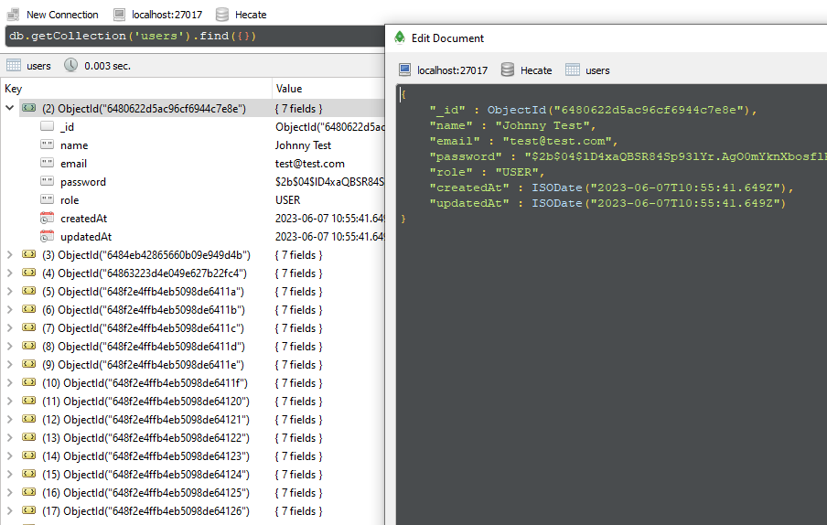
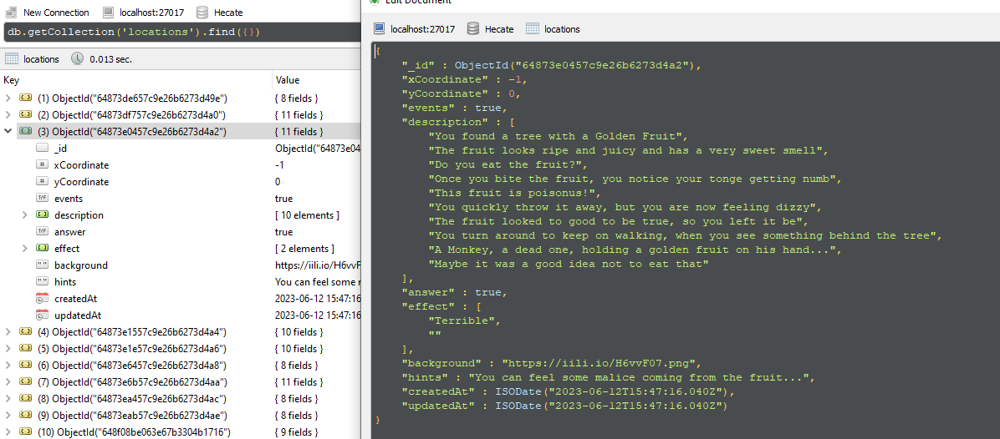
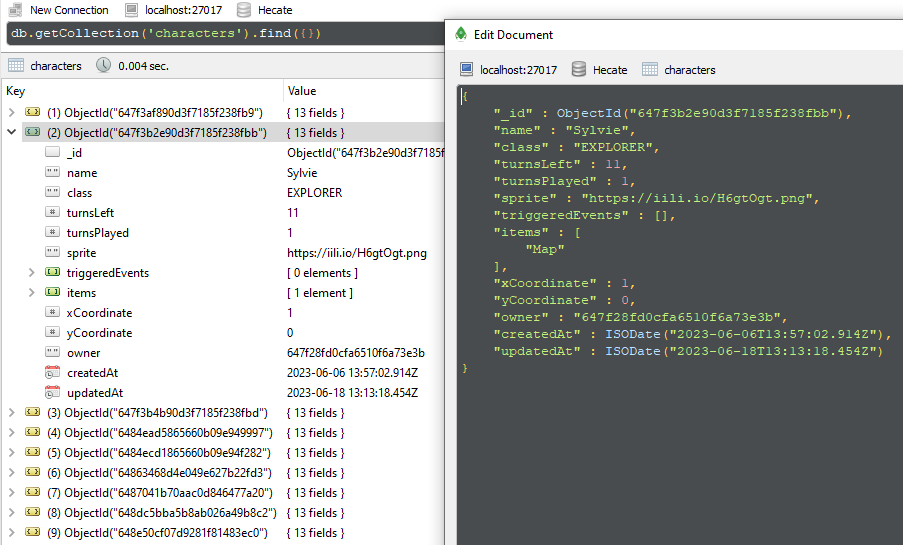
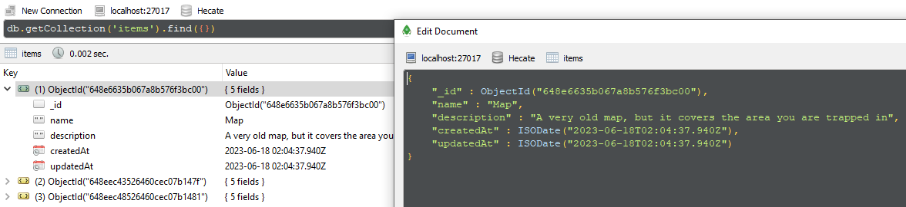

# Proyecto Final: Paths of Hecate (Backend)

Proyecto final creado para GeeksHub Academy.

El objetivo de este projecto es demostrar todas las habilidades que he aprendido a lo largo del bootcamp, y, en este caso, he decidido hacerlo mediante un juego.

## Tecnologías:

Se ha realizado con MongoDB (mongoose), express y NodeJS. 

 ### Estructura:

La aplicación está dividida en un archivo principal (app.js) responsable del lanzamiento de la aplicación y de todas las entidades modularizadas, cada una con su modelo, su router y su controlador asociados dentro de su carpeta, de modo que resulte fácil encontrar y editar las partes del código necesarias sin que se vean afectadas otras secciones no relacionadas.

La entidad principal, por supuesto, es el Usuario, que permite a las personas registrarse y acceder a la pagina, pero, en el caso de este projecto son aun mas importantes las entidades de Personajes y Localizacion. Estas entidades son las que registran en que lugar se encuentra actualmente el jugador, son la que registran todo el progreso que ha realizado, y las que contienen todo lo que el jugador aun no encuentra.

 * ### Localizacion:
 
    La Localizacion, o Location, es la base de este programa, las otras entidades y funciones recurren a esta entidad para obtener los datos que necesitan para funcionar. A que lugares puede ir el jugador? Que debe de ocurrir una vez que el jugador cambien de posicion? Todo esto es determinado por Localizacion, la cual tiene datos predefinidos y que en ningun momento pueden ser alterados.

    

 * ### Personaje:
    
    Los personajes son la cara del usuario antes este juego, es posible escoger entre tres clases diferentes, cada una con una ventaja, y escoger entre dos posibles personajes de cada clase. La entidad del personaje es la que se encarga de registrar el progreso del jugador, actualiza constantemente la posicion en la que se encuentra, asi que los eventos que ha activado, el tiempo que le queda, y los objetos que puede cargar.

    
 
 
 * ### Objetos:
 
    A pesar de ser la entidad mas pequeña de este proyecto, los objetos siguen siendo muy importantes para la partida. Dependiendo de que objetos poseas en tu inventario puedes tener ciertas ventajas, como un mapa de la zona, o puede que incluso sean necesarios para poder avanzar en el juego, por lo que nunca deberias de dejar de explorar en busca de objetos.

    

 
 
 
